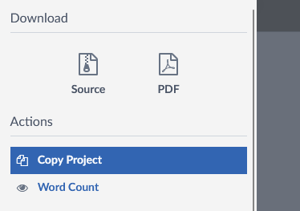
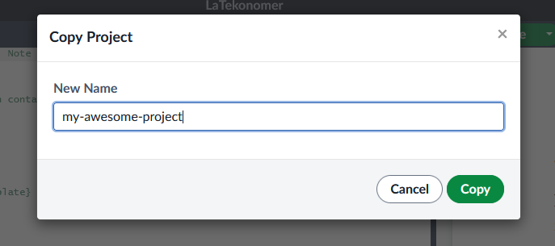
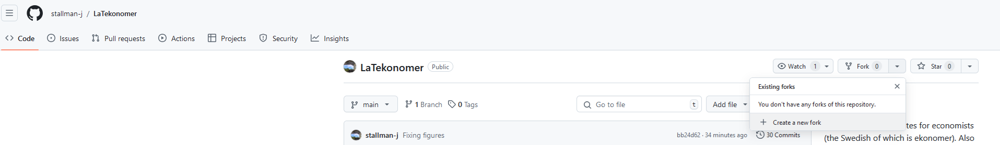
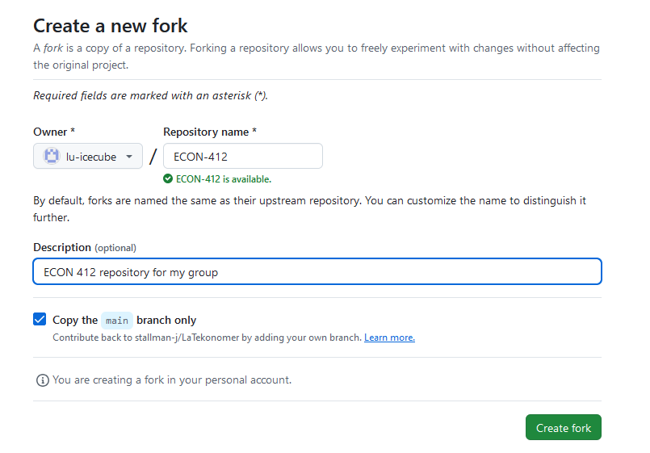
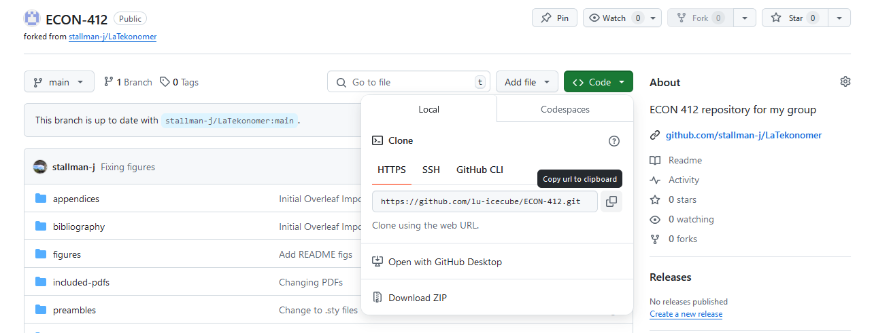

<!-- Improved compatibility of back to top link: See: https://github.com/othneildrew/Best-README-Template/pull/73 -->
<a id="readme-top"></a>
<!--
*** Thanks for checking out the Best-README-Template. If you have a suggestion
*** that would make this better, please fork the repo and create a pull request
*** or simply open an issue with the tag "enhancement".
*** Don't forget to give the project a star!
*** Thanks again! Now go create something AMAZING! :D
-->


<!-- PROJECT SHIELDS -->
<!--
*** I'm using markdown "reference style" links for readability.
*** Reference links are enclosed in brackets [ ] instead of parentheses ( ).
*** See the bottom of this document for the declaration of the reference variables
*** for contributors-url, forks-url, etc. This is an optional, concise syntax you may use.
*** https://www.markdownguide.org/basic-syntax/#reference-style-links
-->
[![Contributors][contributors-shield]][contributors-url]
[![Issues][issues-shield]][issues-url]
[![GNU GPLv3 License][license-shield]][license-url]


<!-- PROJECT LOGO -->
<br />
<div align="center">
  <a href="https://github.com/stallman-j/LaTekonomer">
    
  </a>

<h3 align="center">LaTekonomer</h3>

  <p align="left">
    LaTekonomer aims to provide those Overleaf/LaTex templates that many economists wish someone else would make and maintain.
     <br />
     <br />
    The templates include but are not limited to: general math writing; homework write-ups; article write-ups with bibliographies; professional but simple dark and light Beamer templates; tables (including three-part tables with footnotes); figures; and a few research project assignments.
    <br />
      <br />
    The research project assignments come from ECON 412 International Environmental Economics, a course taught at Yale University by Sam Kortum, for which Jillian Stallman has been teaching assistant in Fall 2023 and Fall 2024.
      <br />
      <br />
    Many of these tables and figures are outputs of vignettes and code provided in the R package  <a href="https://github.com/stallman-j/ekonomR">**ekonomR**</a>. **ekonomR** and **LaTekonomer**  are designed to be complementary research templates. If you're starting a new project I highly recommend checking out **ekonomR**, but the use of **LaTekonomer** does not require **ekonomR** or vice versa.
    <br />
    <br />
    <!--
    <a href="https://github.com/stallman-j/LaTekonomer">**Explore the docs »**</a>
    <br />
    <br />
    <a href="https://github.com/stallman-j/LaTekonomer">View Demo</a>
    ·
      --->
    <a href="https://github.com/stallman-j/LaTekonomer/issues/new?labels=bug&template=bug-report---.md">Report Bug</a>
    ·
    <a href="https://github.com/stallman-j/LaTekonomer/issues/new?labels=enhancement&template=feature-request---.md">Request Feature</a>
  </p>
</div>


<!-- TABLE OF CONTENTS -->
<details>
  <summary>Table of Contents</summary>
  <ol>
    <li>
      <a href="#about-the-project">About The Project</a>
      <ul>
        <li><a href="#built-with">Built With</a></li>
      </ul>
    </li>
    <li>
      <a href="#getting-started">Getting Started</a>
      <ul>
        <li><a href="#installation">Installation</a></li>
      </ul>
    </li>
    <li><a href="#usage">Usage</a></li>
    <li><a href="#roadmap">Roadmap</a></li>
    <li><a href="#contributing">Contributing</a></li>
    <li><a href="#license">License</a></li>
    <li><a href="#contact">Contact</a></li>
    <li><a href="#acknowledgments">Acknowledgments</a></li>
  </ol>
</details>


<!-- ABOUT THE PROJECT -->
## About The Project

[![Product Name Screen Shot][product-screenshot]](https://example.com)

Rather than carrying along a hodgepodge of LaTex files with all those settings that you got just right, or trying to figure out how to ask ChatGPT how to do it all over again, why not have a template that you can use to start off any new project that contains the LaTex syntax for the stuff you tend to use?

The goal of LaTekonomer is to provide, for me, for you, for your students, for your collaborators, a place to store that code that you spent hours searching StackExchange to finally finagle just right. This is where you can find the basic code for a three-part long table that stretched across multiple pages with footnotes at the very end. This is where your students can find 


Have you ever thought, as you looked back through your old Overleaf projects or Dropbox tex files, that it would be really nice if you just had the syntax for all those tables or side-by-side figures or Beamer templates all in one place? Well, now you do!


<p align="right">(<a href="#readme-top">back to top</a>)</p>


<!-- GETTING STARTED -->
<a id="getting-started"></a>

## Getting Started

This repository is linked with an Overleaf Project, so there are many ways you might want to use it on your own machine. I'll go over the steps for each of the below, each of which comes its pros and cons.

1. Copying the <a href="https://www.overleaf.com/read/mpdhvnnjzsxq#7e6598">LaTekonomer Overleaf Template</a>
   - Do this if the following seem to apply to you:
      * You've never used LaTex before (but want to learn) and have not used GitHub before (and don't feel a need to learn just yet).
      * You use Overleaf but don't keep a local LaTex installation on your computer.
    - Installing LaTex locally can be a pain. If you're not sure which to do, try the Overleaf route first. You can always install LaTex locally later.
    - Once you have an Overleaf project, you can also sync it online with GitHub. You can also start with Overleaf and do this later. This is what I recommend if you're new to GitHub but you want a soft introduction to using it.
2. Forking the Git Repository
   - <a href = "https://docs.github.com/en/get-started/start-your-journey/downloading-files-from-github" > Forking </a> means that you copy this LaTekonomer Github repository to your own Github repository with a (hopefully) different name, which you then take as the foundation for your own project.
   - Do this if you:
        * Already use Github or
        * Want an excuse to start using Github
   - Why would you want to start using GitHub?
        * GitHub is a standard method for making research code, inputs, and outputs transparent, replicable, and sharable among many fields. Economics is catching up in this trend.
        * If you're just starting a research project, starting it with Github allows you to maintain version control throughout your project without having to do something like Dropbox rewind. Your future self will thank you.
        * If you have any collaborators (or end up getting any collaborators), it'll allow them to join your project. You can work together on the project without stepping on each others' toes and keep track of each other's contributions.
        * You'll save yourself from possibly losing all your code or output if you run into tech problems
   - If you're planning to just use this with Overleaf and not planning on having the files on your local system, instead follow the steps for **copying the Latekonomer Overleaf Template.** From there, it's really easy to set up Overleaf with GitHub and you don't have to bother with Git bash and the Git terminal.
3. Downloading the files into your local system
   - You can download either from the <a href="https://www.overleaf.com/read/mpdhvnnjzsxq#7e6598">LaTekonomer Overleaf Template</a> or from Github.
   - To use these with LaTex, though, you'll need a local LaTex installation.
   - Do this if you already use LaTex locally and you've already got some way of backing up your files (e.g. all your files live in Dropbox anyways and you don't plan on having collaborators for this project) and don't want to invest in GitHub.
   - If you do _not_ have a way of backing up your files and you want to download locally just because it's temporarily easier, I highly recommend that you reconsider investing some time into Git, or at the very least building up the practice of starting all your projects in folders that sync automatically to a cloud. Ideally, you would have for all your important files at least three different versions:
     1) a local version,
     2) a cloud version,
     3) an external physical version (e.g. an external hard drive backup).
   
   Technical issues happen all the time, and writing in LaTex can be time intensive. Not having backups means you're potentially throwing away hours, days, or even months of work if your computer gives up on you.

What do I do these days? 

 - A combination of all the above: I have Overleaf sync with Github _and_ a local repository on my computer that automatically syncs with my cloud and which has Git set up to also push and pull changes from my local copy to my GitHub repository. Plus an external hard drive that backs the local copy up every night. I once lost a whole semester's worth of manual inputting work because I didn't sync correctly to Dropbox. Don't be me. Learn the easy way.

 - If I have a lot of images or tables to change or add, I tend to use the local repository to avoid having to drag and drop files into Overleaf. If I'm mostly editing text, I tend to use Overleaf because it compiles so quickly, the interface is pretty, and it doesn't generate tons of aux files. You have to be mindful about where you're pushing and pulling from, though, otherwise you can end up with conflicting files. 

 - GitHub is great about recognizing what lines specifically have changed (this is what makes it such a good collaboration tool!), so I just make sure I keep up on my pushes and pulls when I switch between the Overleaf and local copy. I don't tend to edit the files directly in GitHub.

<!-- Installation -->

<a id="installation"></a>

## Installation

Your prerequisites and installation steps will depend on how you're anticipating you'll use these templates. Let's go through the three main ways of doing this. There are tons of tutorials out there. This is just what has worked well for me.

### Copying the LaTekonomer Overleaf Template

1. You'll need an <a href = "https://www.overleaf.com/" > Overleaf account </a>.

If you're at a university, your university email will likely give you access to Overleaf premium, which would allow you to sync Overleaf directly to GitHub.

2. Once you have your account, log into Overleaf.

3. Click on this <a href = "https://www.overleaf.com/read/mpdhvnnjzsxq#7e6598" > LaTekonomer share link </a>.

4. Click "Menu" on the top left of the screen with the project showing in Overleaf, and then "Copy Project"

<div class="figure" align="center">

<p class="caption">Copy the Overleaf Project</p>
</div>

5. Rename to something like "my-awesome-project." If this is for International Environmental Economics, something like "ECON-412" would be good.

<div class="figure" align="center">

<p class="caption">Rename your project</p>
</div>

You're set up! Easy as that. 

Now that you've got your project in Overleaf, if you have an Overleaf premium account, you can also <a href = "https://www.overleaf.com/learn/how-to/GitHub_Synchronization"> set it up to sync with GitHub. </a> 

I recommend trying this out if you're new to GitHub and you want to start getting used to it without having to learn about coding from the command line or dealing with a finicky installation just yet.

[To add and link here: Vignette for "Getting started with writing up homework" that's linked to the "Copy the LaTekonomer Overleaf Template"]

### Forking the Git Repository

1. You'll need a <a href = "https://github.com/" > GitHub account. </a>. I haven't found there to be an advantage to using an institutional email at this point.
2. You'll need a LaTex installation on your local machine.
   - If this is your first time with both LaTex and GitHub, I recommend going through Overleaf with the first option above. It allows you to collaborate easily and learn the ropes without worrying about figuring out all the installation nuances of LaTex or GitBash just yet.
   - If you really like the idea of having a local copy without needing the internet and you're willing to spend some time tinkering with the installation, then there are a lot of ways you can set up LaTex on your local machine.
        * I use Sublime Tools (a speedy text editor that's a lot like VisualStudio) with LaTexTools. You can follow the installation <a href = "https://latextools.readthedocs.io/en/latest/install/" > here </a>.
        * As you're going through the guide, you might get into the question of which LaTex installation to download.
            - For Mac, you'll want to download Mactex.
            - For Windows, download MikTex if you want LaTex taking up a little less space on your machine. Remember to allow it to download packages on the fly, though, and allow it to add itself to your paths. Download TexLive if you never want to worry about a missing package or think about LaTex again once you've downloaded it, but are willing to devote some 5G of your computer storage to LaTex. If you're indifferent, go with TexLive. More people maintain it.
        * To get a dark mode that feels a bit like Overleaf, follow [this tutorial](https://medium.com/@iitrabhi/how-to-setup-sublime-as-a-beautiful-latex-editor-dark-mode-windows-7ec5e0a24878) and then navigate to `File` -> `Open Folder` and open your project folder (for me, that's `LaTekonomer` itself). If it's still not working, go to `View`-> `Sidebar` and click `Show Sidebar.`
        * For a light theme, check out <a href = "https://github.com/dempfi/ayu"> AYU </a>. I won't wade into the light-theme, dark-theme debate, but I personally use this one.
              * To make the pdf viewer match, I also change the following Sumatra settings (`Settings`->`Advanced Options`) replacing the settings of `FixedPageUI` with the following (colors obtained from [https://github.com/ayu-theme/ayu-colors](https://github.com/ayu-theme/ayu-colors))

          ```
          FixedPageUI [
          TextColor = #5C6166
          BackgroundColor = #FCFCFC
          SelectionColor = #035BD6
          WindowMargin = 2 4 2 4
          PageSpacing = 4 4
          InvertColors = false
          HideScrollbars = false
          ]
          ```
3. You'll need to set Git up on your device.
   - I set up my GitHub originally to let it version control with R, so followed the book <a href = "https://happygitwithr.com/"> <em> Happy Git and GitHub for the useR </em> </a>.
       * If you're thinking of using the complementary <a href = "https://github.com/stallman-j/ekonomR" >** ekonomR ** </a> R package, I highly recommend following the ** Happy Git ** book first, and then coming back here to set up <em> this </em> repository through the Git command line. You'll have installed the Git terminal in ** Ch. 6: Install Git ** when you're following this book, and that's where you'll learn what the Git command line is if you don't already know.
       * Getting GitHub to link to your computer securely can take a little effort, so give yourself a weekend on the off chance that you need to go deep into the troubleshooting help. Do <em> not </em> try to do any of this late at night when you're tired. You'll make yourself miserable and there are lots of little things that can go wrong.
       * ** Happy Git ** is supremely well written. Start at the beginning and go through chapter 12, "Connect RStudio to Git and GitHub."
    - If you haven't done this before and are using this project as an excuse to learn some GitHub but aren't planning on using this with R, the <a href = "https://docs.github.com/en/get-started/start-your-journey/about-github-and-git" > GitHub docs </a> are a good place to get started. I occasionally use <a href = "https://www.sublimemerge.com/" > Sublime Merge </a> as a Git client. 
4. Assuming you've either gone off to ** Happy Git ** and come back or figured out your Gitting on your own, you're ready to fork the ** LaTekonomer ** repository using your Git bash terminal. If you don't know what the Git bash terminal is, you did not successfully complete Step 2.
   - You can bring up the Git terminal either in RStudio -> Terminal (next to the "Console" tab), or in your Applications go to Git and click on Git Bash, which should open up a free-floating terminal.
   - You do ** NOT ** want the Windows PowerShell terminal or whatever it is that Mac uses (I think? To do: Ask Mac users who use Git how they use the terminal).
5. Go to the <a href="https://github.com/stallman-j/LaTekonomer"> repository page for LaTekonomer. </a>
6. Under the "Fork" option, click "Create a new fork"

<div class="figure" align="center">

<p class="caption">Fork the repository</p>
</div>

7. Change the name of the repository to something for your new project (like ECON 412), edit the description to match your new project, and click the "Create fork" button.

<div class="figure" align="center">

<p class="caption">Edit fork details</p>
</div>

8. On the new repository page that pops up in your own repository and click on the green "Code" button. If you're using HTTPS protocol, click the "copy" icon to copy to URL for your newly created repository.
    - If you followed ** Happy Git **, you should be using the HTTPS protocol. If you're using SSH, you're on your own!


<div class="figure" align="center">

<p class="caption">copy new repository URL</p>
</div>

9. In your Git Bash (or RStudio Git) terminal, change the working directory to the folder in which you would like to create this new project.
    * Putting your project in a folder which is also synced to a cloud (like OneDrive or Dropbox) doubly backs your stuff up and allows you do make local changes from multiple devices. I've read that doing this might cause syncing issues but have never run into any myself.
    * I use the cloud <a href = "https://www.pcloud.com/" > pCloud </a>, which is like Dropbox but with lifetime subscriptions rather than annual, and some other fun bells and whistles.
    * If you're at Yale, you have free storage with OneDrive. If you're doing this in OneDrive, make sure that you've opened up the OneDrive app so that your folders register the correct paths.
    * If you're on a Windows system, the command might look like the following, where you change ```[your-username]``` to be whatever your username on your PC is. 

 ```sh
   cd "C:\Users\[your-username]\OneDrive - Yale University"
   ```

*[To confirm: What's the relevant directory for a Mac? Try ```"~/OneDrive - Yale University"``` ]

10. Now clone your newly forked repository with the URL you copied in Step 8. In the Git terminal you'll do it like this (changing the ```your-github-username``` and ```your-new-project-name``` as appropriate).

```sh
    git clone https://github.com/your-github-username/your-new-project-name.git
```

11. You're now ready to start making changes! There are a couple commands you'll use over and over from the Git bash terminal, so I'll put them here for easy reference.

- To push changes you've made locally from your local machine to GitHub, in a Git terminal, first make sure your directory is the right one with ```pwd``` (display the present working directory).
   * You don't need to do this if you can just read off the terminal cursor that you're in the right location.

 ```sh
   pwd
   ```

If this isn't the place where you put your fork, then do

```sh
    cd "path-to-fork"
```

where `"path-to-fork"` is something like `"C:/Users/stallman/Projects"` or `"C:/Users/stallman/OneDrive - Yale University"`

Tell git to add everything to the roster of things to update:

```sh
git add .
```

Commit the changes with a message that your future self could read and know what you were changing.
```sh
git commit -m "your commit message here"
```

Push those changes onto your main branch.
```sh
git push -u origin main
```

- If you made changes online through GitHub or a collaborator made changes so that your GitHub repository is more updated than your local machine, you'll also want to **pull** changes.

If you're not sure you're in the current working directory where your forked repository lives on your local computer, check it. 
 ```sh
   pwd
   ```

If this isn't the place where you put your fork, then do

```sh
    cd "path-to-fork"
```
Pull the changes.

```sh
git pull
```

[To add: Now the LaTekonomer repository has been updated, but I've already made a fork. Can I do another pull?]

### Downloading the files to your local system

I've put this last because if you're not going to Git, you're not going to Git, but you should really consider it. 

Downloading the raw files is super easy. You can either do this via Overleaf or from GitHub.

[To add: Straight-up downloading steps and recommendations]

<p align="right">(<a href="#readme-top">back to top</a>)</p>


<!-- USAGE EXAMPLES -->
## Usage

Use this space to show useful examples of how a project can be used. Additional screenshots, code examples and demos work well in this space. You may also link to more resources.

_For more examples, please refer to the [Documentation](https://example.com)_

<p align="right">(<a href="#readme-top">back to top</a>)</p>


<!-- ROADMAP -->
## Roadmap

- [ ] Add vignette for "Getting started with writing up homework" that's linked to the "Copy the LaTekonomer Overleaf Template"
- [ ] Feature 2
- [ ] Feature 3
    - [ ] Nested Feature

See the [open issues](https://github.com/stallman-j/LaTekonomer/issues) for a full list of proposed features (and known issues).

<p align="right">(<a href="#readme-top">back to top</a>)</p>


<!-- CONTRIBUTING -->
<a id="contributing"></a>
## Contributing

Contributions are the foundation of the open source community. It's how we get nice things. Any contributions you make are **greatly appreciated**.

If you have a suggestion that would make this better, please fork the repo and create a pull request. You can also open an issue with the tag "enhancement".

1. Fork the Project
2. Create your Feature Branch (`git checkout -b feature/AmazingFeature`)
3. Commit your Changes (`git commit -m 'Add some AmazingFeature'`)
4. Push to the Branch (`git push origin feature/AmazingFeature`)
5. Open a Pull Request

<p align="right">(<a href="#readme-top">back to top</a>)</p>

### Top contributors:

<a href="https://github.com/stallman-j/LaTekonomer/graphs/contributors">
  
</a>


<!-- LICENSE -->
## License

Distributed under the GNU General Public License v3.0. See `LICENSE.txt` for more information.

<p align="right">(<a href="#readme-top">back to top</a>)</p>


<!-- CONTACT -->
## Contact

Jillian Stallman - jillian.stallman@yale.edu

Project Link: [https://github.com/stallman-j/LaTekonomer](https://github.com/stallman-j/LaTekonomer)

<p align="right">(<a href="#readme-top">back to top</a>)</p>


<!-- ACKNOWLEDGMENTS -->
## Acknowledgments


* [othneildrew/Best-README-Template](https://github.com/othneildrew/Best-README-Template)
* [Choose an Open Source License](https://choosealicense.com)
* [GitHub Emoji Cheat Sheet](https://www.webpagefx.com/tools/emoji-cheat-sheet)
* [Malven's Flexbox Cheatsheet](https://flexbox.malven.co/)
* [Malven's Grid Cheatsheet](https://grid.malven.co/)
* [Img Shields](https://shields.io)
* [GitHub Pages](https://pages.github.com)
* [Font Awesome](https://fontawesome.com)
* [React Icons](https://react-icons.github.io/react-icons/search)

<p align="right">(<a href="#readme-top">back to top</a>)</p>

<!-- MARKDOWN LINKS & IMAGES -->
<!-- https://www.markdownguide.org/basic-syntax/#reference-style-links -->
[contributors-shield]: https://img.shields.io/github/contributors/stallman-j/LaTekonomer.svg?style=for-the-badge
[contributors-url]: https://github.com/stallman-j/LaTekonomer/graphs/contributors
[forks-shield]: https://img.shields.io/github/forks/stallman-j/LaTekonomer.svg?style=for-the-badge
[forks-url]: https://github.com/stallman-j/LaTekonomer/network/members
[stars-shield]: https://img.shields.io/github/stars/stallman-j/LaTekonomer.svg?style=for-the-badge
[stars-url]: https://github.com/stallman-j/LaTekonomer/stargazers
[issues-shield]: https://img.shields.io/github/issues/stallman-j/LaTekonomer.svg?style=for-the-badge
[issues-url]: https://github.com/stallman-j/LaTekonomer/issues
[license-shield]: https://img.shields.io/github/license/stallman-j/LaTekonomer.svg?style=for-the-badge
[license-url]: https://github.com/stallman-j/LaTekonomer/blob/master/LICENSE.txt
[linkedin-shield]: https://img.shields.io/badge/-LinkedIn-black.svg?style=for-the-badge&logo=linkedin&colorB=555
[linkedin-url]: https://linkedin.com/in/linkedin_username
[product-screenshot]: images/screenshot.png
[Next.js]: https://img.shields.io/badge/next.js-000000?style=for-the-badge&logo=nextdotjs&logoColor=white
[Next-url]: https://nextjs.org/
[React.js]: https://img.shields.io/badge/React-20232A?style=for-the-badge&logo=react&logoColor=61DAFB
[React-url]: https://reactjs.org/
[Vue.js]: https://img.shields.io/badge/Vue.js-35495E?style=for-the-badge&logo=vuedotjs&logoColor=4FC08D
[Vue-url]: https://vuejs.org/
[Angular.io]: https://img.shields.io/badge/Angular-DD0031?style=for-the-badge&logo=angular&logoColor=white
[Angular-url]: https://angular.io/
[Svelte.dev]: https://img.shields.io/badge/Svelte-4A4A55?style=for-the-badge&logo=svelte&logoColor=FF3E00
[Svelte-url]: https://svelte.dev/
[Laravel.com]: https://img.shields.io/badge/Laravel-FF2D20?style=for-the-badge&logo=laravel&logoColor=white
[Laravel-url]: https://laravel.com
[Bootstrap.com]: https://img.shields.io/badge/Bootstrap-563D7C?style=for-the-badge&logo=bootstrap&logoColor=white
[Bootstrap-url]: https://getbootstrap.com
[JQuery.com]: https://img.shields.io/badge/jQuery-0769AD?style=for-the-badge&logo=jquery&logoColor=white
[JQuery-url]: https://jquery.com 